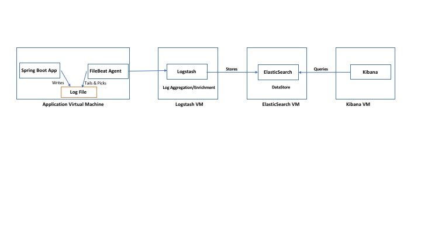

# SpringBoot, Logback, Sleuth - ELK Integration
Demo that uses logback, logstash-logback-encoder, sleuth and dropwizard to :
- Generate application logs in json using logstash-logback-encoder and logback
- Create custom key value pairs in json
- Logging aspect to capture timing for Rest Controllers and Services
- Sleuth adds trace id and span id for log corelation

The json log enteries are stored in a log file. Filebeat and Logstash configuration files are provided. If you have FilebeatAgent, Logstash, ElasticSearch and Kibana running using the configuration files, you can build kibana dashboards

## Compile and create jar
./mvnw clean install
## Run
java -jar target/demo-0.0.1-SNAPSHOT.jar 
## Log File Name & Location
The log file would be created as build/demo.json
